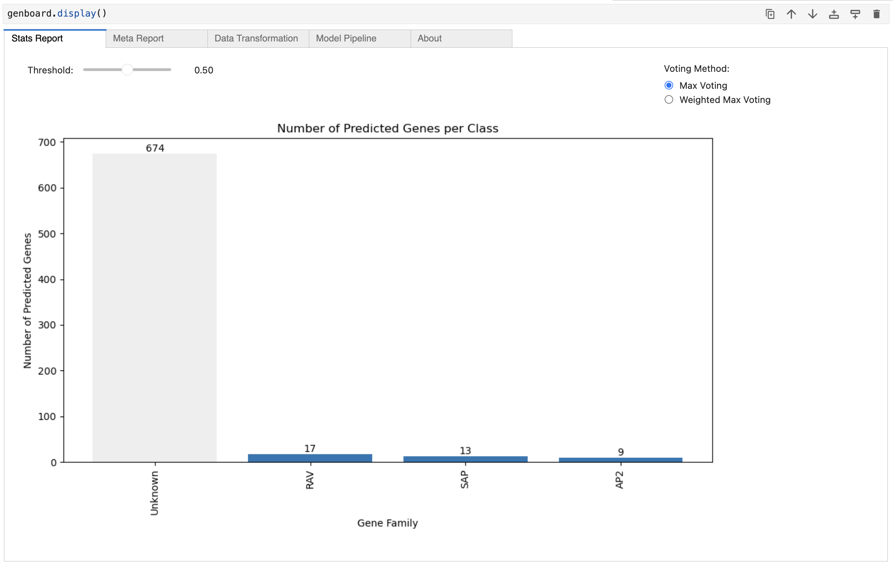

# pygenomics
`pygenomics` is an all-in-one tool designed for the analysis and classification of genomic data using advanced machine learning techniques. The project focuses on creating and utilizing models trained on various gene families to predict and classify sequences based on k-mer methods. 
With `pygenomics`, you can:
- **Access Pretrained Models**: Utilize pretrained models for different gene families.
- **K-mer Methods for Sequence Classification**: Represent and classify data using k-mer methods.
- **Generate Detailed Reports**: Produce comprehensive classification reports with metrics such as F1 score, recall, accuracy, precision, and confusion matrices.
- **Flexible Prediction Models**: Employ both single k-mer size or multi k-mer models for your predictions.


## 1- Setup Environment

### Step 1: Create Conda Environment

First, create the `pygenomics` environment from the provided YAML file.

```bash
cd pygenomics
conda env create -f ./pygenomics.yml
```

### Step 2: Activate Conda Environment

Activate the pygenomics environment.

```bash
conda activate pygenomics
```

### Step 3: Install Jupyter Kernel

Install the environment as a Jupyter Notebook kernel.

```bash
pip install ipykernel
python -m ipykernel install --user --name pygenomics --display-name "PyGenomics"
```

### Step 4: Verify Installation

Verify that the kernel is installed correctly.

```bash
jupyter kernelspec list
```

### Step 5: Start Jupyter Notebook

Start Jupyter Notebook to begin working with PyGenomics.

```bash
jupyter notebook
```

## 2- Build pretrained model

We have to move into notebook folder and execute the python file named `pyrunner`

```bash
cd notebook
```

The python file should look like this. Depending on if we wanna run the program using multiprocess we have to set either `multiprocess=True` or `multiprocess=False`.

```python
import os
import json
import multiprocessing
import papermill as pm

# Utils
def run_notebook(gene):
    input_notebook = "01-approach2_kmer_neural_network.ipynb"
    notebook_name = os.path.splitext(input_notebook)[0]
    gene_ = gene.replace('/', '__')
    output_notebook = f"AutoSave/{notebook_name}-{gene_}.ipynb"

    # Run the notebook with the specified gene
    pm.execute_notebook(
        input_notebook,
        output_notebook,
        parameters=dict(gene_familly=gene),
        timeout=-1,
        kernel_name='pygenomics'
    )

if __name__ == "__main__":
    # List of genes 
    gene_info_path = "../data/gene_info.json"
    with open(gene_info_path, 'r') as json_file:
        gene_info = json.load(json_file)

    # Output directory
    os.makedirs("AutoSave", exist_ok=True)

    # EXEC NATURE
    multiprocess = False

    if multiprocess:
        # Run notebooks concurrently using multiprocessing
        num_processes = multiprocessing.cpu_count()
        print('NUMBER OF PROCESSES: ', num_processes)
        with multiprocessing.Pool(num_processes) as pool:
            pool.map(run_notebook, gene_info.keys())
    else:
        # Run notebooks sequentially
        for gene in gene_info.keys():
            run_notebook(gene)
```

The next step is to run this file then till the program finish

```bash
python pyrunner
```

## 3- Pretrained Model and documentation

After running the notebook, you can find the results in the `Output` directory. Here's what you will find:

1. **Model Files**:
    - Located in `Output/Model`.
    - Inside this directory, you will find folders named after gene families.
    - Each gene family folder contains:
        - Model `.h5` files for various k-mer sizes.
        - `feature_mask.json` files.

2. **Reports**:
    - Located in `Output/Reports`.
    - Each report is specific to a gene family.
    - Reports include:
        - Model architecture and parameters.
        - Learning curve.
        - Train set class distribution.
        - Classification metrics: F1 score, recall, accuracy, precision.
        - Confusion matrix for each k-mer size.

## 4- How to Make Predictions Using the Model

To make predictions using the trained model, follow these steps:

1. **Set the k-mer Size**:
    - Choose the k-mer size you want to use for predictions.
    - You can use a single k-mer model or a multi k-mer model.

2. **Import the Prediction Classes**:
    - Import `SingleKModel` or `MultiKModel` from the `pretrained.predictor` module located in the `notebook` directory.

3. **Create a Notebook or Python File**:
    - Create a new notebook or Python file and include the following code:

```python
from pretrained.predictor import SingleKModel, MultiKModel

# Example for SingleKModel
kmodel = SingleKModel(kmer_size=3)
kmodel.load("Ach_pep_kiwi.fas", format="fasta")
genboard = kmodel.predict()
genboard.display()
```
